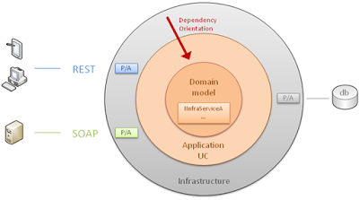

# The SOLID Architecture

## Table Of Contents

* [Introduction](#introduction)
* [Architecture Key Aspects](#architecture)
* [Microservices Described](#microservices)

## Introduction

[SOLID](http://en.wikipedia.org/wiki/SOLID_(object-oriented_design) stands for five basic principles of object-oriented programming and design. The principles, when applied together, intend to make it more likely that a programmer will create a system that is easy to maintain and extend over time.

SOLID is an acronym where:-

* S stands for SRP (Single responsibility principle
* O stands for OCP (Open closed principle)
* L stands for LSP (Liskov substitution principle)
* I stands for ISP ( Interface segregation principle)
* D stands for DIP ( Dependency inversion principle)

There is an excellent video by [Derick Baily](https://github.com/derickbailey) named [SOLID JavaScript In A Wobbly](https://www.youtube.com/watch?v=TAVn7s-kO9o) that provides clear examples of each of these principals applied in JavaScript.

Many people are using these principles in architecture to achieve maintainability and extendability at the architecture level.  Plus this allows the same primary principals to be applied across the entire application from a single module to an enterprise application architecture.

## Architecture Key Aspects

### Hexagonal (Ports and Adapters)

Also known as 'Ports and Adapters', or clean, or onion architecture, the hexagonal architecture is an application-architecture-style that helps us to focus on our business goals without being tied or jeopardized by our technical frameworks or infrastructure choices.

In this model there is no such thing as 'front-end' (users interactions) or 'back-end' (db) anymore, but two primary areas instead: the inside (with applicative-use-case-handlers and business domain code) and the outside (with all our infrastructure code: db access, messaging & communication bindings, etc). If you now combine this model with the [dependency inversion principle](http://en.wikipedia.org/wiki/Dependency_inversion_principle) which states that High-level modules should not depend on low-level modules. Both should depend on abstractions, you can easily infer that this model dictates that you can only point inwards the hexagon / circle (infrastructure being the low-level stuffs in that context).

Interactions between those two areas (in and out) are achieved by ports and adapters (P/A in the diagram below). In a nutshell, events or clients requests arrive from the outside world at a port, and the technology-specific adapter converts it into a usable procedure call or message and passes it to the application layer.

Key points:

* Input and output ports to facilitate communication with the core Domain Model.

* Adapters are created for each I/O port and consumer. Siting between clients, on the outside, and the core, on the inside.

* Inputs: HTTP (REST, SOAP), message queue (AMQP), Outputs: persistence, messaging

Strengths and benefits of the hexagonal architecture include:

* Sustainability / Timelessness: by decoupling our application-business code from the tools we are using (i.e. the libraries and frameworks), we make it less vulnerable to the erosion of time and yet another framework fads

* Testability: The usage of ports and adapters to communicate with all our infrastructure (e.g. db, messaging systems, etc) eases the usage of mocks in order to test our applicative services and domain code. Tests could even be written for our application service layer before we decide which technology to be plugged with its corresponding port/adapter (whether REST, SOAP, specific messaging, db, etc)

* Adaptability / Time to market: adding a new way to interact with your application is very easy: you just add a new port/adapter to support this new technology and that's it! You can usually have multiple ways or technologies to interact with your application

* Understandability: Rather than having a solution where use cases are completely lost or mixed within all the technical stuff, this architecture style states the emergence of an applicative-use-case-layer (with all your use case handlers in a dedicated module). The proper location to make our functional intentions stand out.

* Use case driven & [DDD](http://en.wikipedia.org/wiki/Domain-driven_design) compliance:  Indeed, with this architecture style, we design our applications with our use cases in mind; not the number of persistence technologies or binding types we will need to support! a pragmatic architect usually defer decisions about the choice of frameworks or tools to be used.

### Command-Query Responsibility Segregation (CQRS)

Separate write operations (commands) from reads (queries).

### Scaling Hexagonal Architecture with Microservices

The term "Microservice Architecture" has sprung up over the last few years to describe a particular way of designing software applications as suites of independently deployable services. This approach is an excellent way to

## Microservices Described
Microservice Architecture is an architectural concept that aims to decouple a solution by decomposing functionality into discrete independently deployable services. Think of it as applying many of the principles of [SOLID](http://en.wikipedia.org/wiki/SOLID_(object-oriented_design) at an architectural level, instead of classes you've got services.

In short, the microservice architectural style is an approach to developing a single application as a suite of small services, each running in its own process and communicating with lightweight mechanisms, often an HTTP resource API. These services are built around business capabilities and independently deployable by fully automated deployment machinery. There is a bare minimum of centralized management of these services, which may be written in different programming languages and use different data storage technologies.

## Characteristics of the Microservice Architecture

As with any definition that outlines common characteristics, not all microservice architectures have all the characteristics describe below, but we do expect that most microservice architectures exhibit most characteristics.

* [Services vs Componentization](#components)
* [Smart endpoints and dumb pipes](#endpoints)
* [Decentralized Data Management](#decentralized_data)
* [Infrastructure Automation](#automation)

### Services vs Componentization
Microservice architectures will use libraries, but their primary way of componentizing their own software is by breaking down into services. We define libraries as components that are linked into a program and called using in-memory function calls, while services are out-of-process components who communicate with a mechanism such as a web service request, or remote procedure call.

One main reason for using services as components (rather than libraries) is that services are independently deployable. If you have an application that consists of a multiple libraries in a single process, a change to any single component results in having to redeploy the entire application. But if that application is decomposed into multiple services, you can expect many single service changes to only require that service to be redeployed. That's not an absolute, some changes will change service interfaces resulting in some coordination, but the aim of a good microservice architecture is to minimize these through cohesive service boundaries and evolution mechanisms in the service contracts.

### Smart endpoints and dumb pipes
When building communication structures between different processes, many products and approaches stress putting significant smarts into the communication mechanism itself. A good example of this is the Enterprise Service Bus (ESB), where ESB products often include sophisticated facilities for message routing, choreography, transformation, and applying business rules.

The microservice architectures favor an alternative approach: smart endpoints and dumb pipes. Applications built from microservices aim to be as decoupled and as cohesive as possible
* they own their own domain logic and act more as filters in the classical Unix sense
* receiving a request, applying logic as appropriate and producing a response.

These are choreographed using simple RESTish protocols rather than complex protocols such as WS-Choreography or BPEL or orchestration by a central tool.

The second approach in common use is messaging over a lightweight message bus. The infrastructure chosen is typically dumb (dumb as in acts as a message router only) - simple implementations such as RabbitMQ or ZeroMQ don't do much more than provide a reliable asynchronous fabric - the smarts still live in the end points that are producing and consuming messages; in the services.

### Decentralized Data Management
Decentralization of data management, at the most abstract level, means that the conceptual model of the world will differ between systems. This is a common issue when integrating across a large enterprise, the sales view of a customer will differ from the support view.

As well as decentralizing decisions about conceptual models, microservices also decentralize data storage decisions.  Microservices prefer letting each service manage its own database, either different instances of the same database technology, or entirely different database systems.

### Infrastructure Automation

Many of the products or systems being built with microservices are being built by teams with extensive experience of Continuous Delivery and it's precursor, Continuous Integration. Teams building software this way make extensive use of infrastructure automation techniques.

Since this isn't an article on Continuous Delivery we will call attention to just a couple of key features here. We want as much confidence as possible that our software is working, so we run lots of automated tests. Promotion of working software 'up' the pipeline means we automate deployment to each new environment.

## Domain-driven JavaScript

[Domain-driven design](http://en.wikipedia.org/wiki/Domain-driven_design) for JavaScript and Node.js.

Apply Domain-driven Design to the Core Domain. That part of the business Domain that is of primary importance to the success of the organization.

## Ubiquitous Language

Shared language within a single Bounded Context.

Used to drive the design of the Domain Model and API.

## Bounded Contexts

Provides a boundary around an application or system within which a Domain Model exists. Constraining a Ubiquitous Language such that terms and phrases have a specific meaning within it.

**Example:** A `Product` in an e-commerce application may have a different meaning in a catalog context, an inventory context and an invoicing context.

## Context Maps

# Tactical Modeling

Applied within a Bounded Context, using DDD’s building block patterns.

## Entities

Are distinguishable from each other due to their unique identity. Rather than their attributes.

Can be continuously changed over a long period of time.

## Value Objects

[Value object](http://martinfowler.com/bliki/ValueObject.html) are small objects where their key property is that they follow value semantics rather than reference semantics.

## Aggregates

An Aggregate is composed of either a single Entity or a cluster of Entities and Value Objects that must remain transactionally consistent throughout the Aggregate’s lifetime.

Instances are persisted using a Repository.

Publish Domain Events.

## Domain Services

Domain logic, domain-specific operations and process that doesn't fit within Aggregates, Entities or Value Objects should be grouped within a Domain Service.

Domain Services are stateless.

Publish Domain Events to indicate the occurrence of significant happenings in the domain. To notify external parties to changes that have occured.

## Domain Events

Inform something that has already happened.

Must be in the past tense and cannot fail.

May be used to notify external Bounded Contexts, or provide notifications for integration with interested third parties.

Allow an Event-Driven Architecture and eventual consistency between Aggregates and/or Bounded Contexts.

## Application Services

Application Services are the direct clients of the domain model. Responsible for task coordination of use case flows, security, authorization and transactions.

No domain business logic should exist in Application Services. Instead, push them into the domain model; within Aggregates, Value Objects or Domain Services.

Application Services may expose functionality through functions accepting primitive types, or possibly DTOs. Alternatively, and preferrably, they will accept Command objects.

## Commands

> Encapsulate a command request as an object. Encapsulate a request as an object, thereby letting you parameterize clients with different requests, queue or log requests, and support undoable operations.

Commands capture the user's intent.

They are named in the imperative: create account; upgrade customer; complete checkout.

A command can fail, or be declined.

Command instances may be passed to an Application Service method. Or published onto a message queue to be dispatched to a Command Handler. These handlers are semantically equivalent to an Application Service method.

## Infrastructure
### Repositories
### Event Publishing
